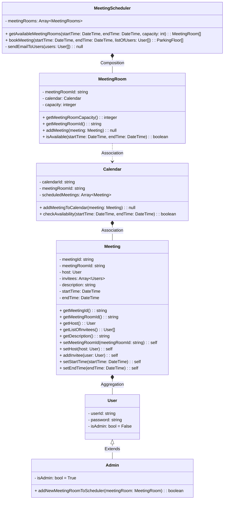

<h3> Problem Statement </h3>
    

        <ul>
            <li>
                Given n meeting rooms. User should be able to book any meeting room with the capacity and availability of the room  based upon the start time and end time of the meeting with notification being sent to the invitees of the meeting.
            </li>
            <li>
                You should use calender for tracking date and time and every meeting room should have its own calendar.
            </li>
            <li> 
                And also history of all the meetings which are booked and asscociated meeting rooms. 
            </li>
        </ul>
    

<h3> Activity Diagram </h3>
    
 User interacts and calls to the meeting scheduler: 
            <ul>
                <li>
                 Queries the available room for the follwing parameters - (start_time, end_time,  capacity) - which should show the list of the available rooms with input slots. 
                </li>
                <li>             
                    Once the meeting rooms are available we can choose from the room of our own choice and book the calendar of that meeting room for that time slot. 
                </li>
                <li>
                    Once the meeting room is booked it should send the meeting notification to all the users for the meeting. We should be able to update the meetings with the invitees and timing of the meeting and room also.
                </li>
            </ul>
    

    

        
             
        Activity diagram for Meeting Scheduler
    

<h3> Class Diagram </h3>

    