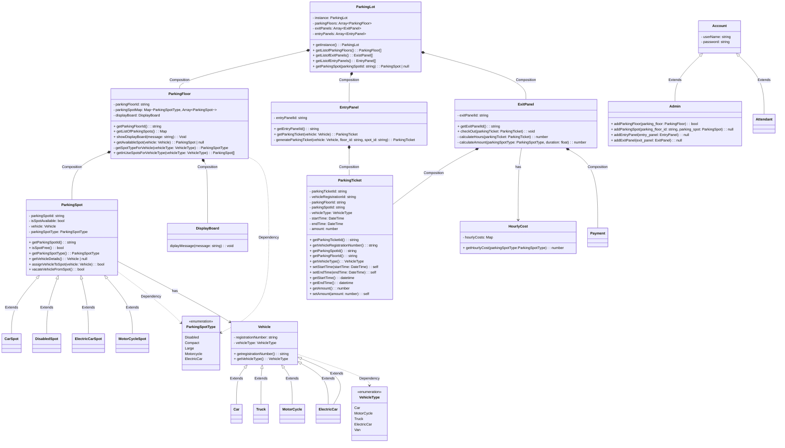

- Following References have been used to Write this Parking Lot code: 
- https://medium.com/@madhankumaravelu93/low-level-system-design-parking-lot-design-part-i-7567d510da1d 
- https://medium.com/@madhankumaravelu93/low-level-system-design-parking-lot-design-part-ii-ab5f4efab90 
- https://mermaid.js.org/syntax/classDiagram.html

