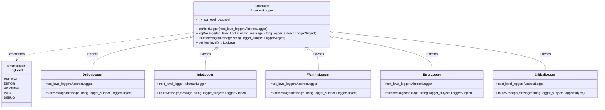

<h1>Logging Framework</h1>
<h3>Requirements</h3>

<ul><li>Should be able to log different categories of logs such as DEBUG, INFO, WARNING, ERROR, CRITICAL</li>
<li>Multiple outputs should be able to write logs in various destinations like console, file, database</li>
<li>Should provide flexibility to add/remove default logging levels and destinations</li>
</ul>

basic design points to consider:
- Since we have different log levels we can have an enum class to define the log level 
- we should have different message output handlers such as stream handlers (console logging), file handler (log file).
- will use chain of responsibility design pattern since we have different log levels which also has hierarchy
- So we should have a Log manager to create the chain of responsibility for the different logger 
- we will have an abstract logger handler and the child classes will be the info logger, debug logger, warning logger, error logger, critical logger etc
- we will use observer design pattern to sync the message for the logs

