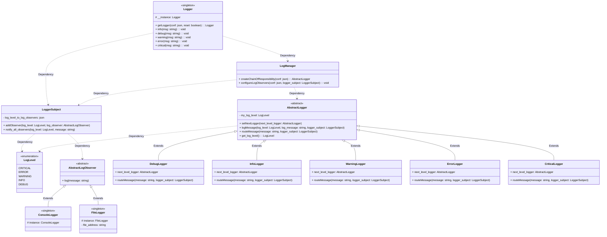

<h1>Logging Framework</h1>
<h3>Requirements</h3>

<ul><li>Should be able to log different categories of logs such as DEBUG, INFO, WARNING, ERROR, CRITICAL</li>
<li>Multiple outputs should be able to write logs in various destinations like console, file, database</li>
<li>Should provide flexibility to add/remove default logging levels and destinations</li>
</ul>

Design strategy:
- Since we have different log levels we will have an enum class to define the log levels 
- we should have different message output handlers such as stream handlers (console logging), file handler (log file). For which we will use singleton pattern as we may not want in a multithreaded program to write the logs in multiple files or multiple console
- will use chain of responsibility design pattern since we have different log levels which also has hierarchy such as debug->info->warning->error->critical
- So we should have a Log manager to create the chain of responsibility for the different logger and also we need to have an intermediate entity which keeps track of the console logger or file logger and what these log observers have subscribed to which types of logs. So it is an observer design pattern. In which logger subject
 will manage the message routing and keeping the subscription details. For example an info log should go to console or to  a file or both these all task will be done by this logger subject.
- we will have an abstract logger handler and the child classes will be the info logger, debug logger, warning logger, error logger, critical logger etc
- Log manager will create the chain of resposibility or linked list type of data structure to log the message when we initialize the logger itself. 
- Following resources have been referenced to create this logger Framework: <a href="https://www.youtube.com/watch?v=RljSBrZeJ3w&t=695s">link</a>

